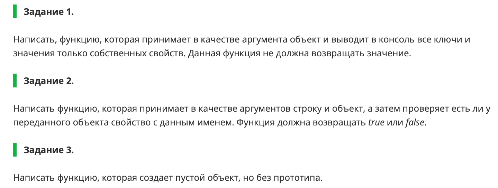
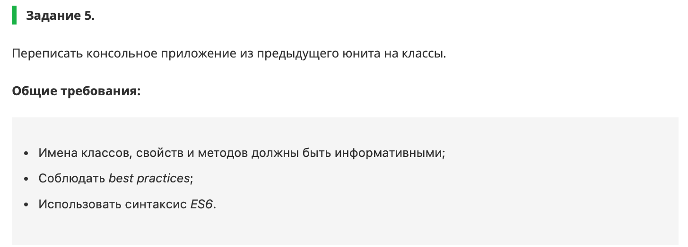

Привет, меня зовут **Алина** 👋

Учусь на курсе  
**Fullstack разработчик на Python**
 
______
Домашние задание по блоку **Frontend-разработка**

[](https://git.io/typing-svg)
---
**Задания:**





_____
**Выполнено в ``VS Code``**


----
```` Спасибо за уделенное время! 🙏 ````

___


[](https://github.com/anuraghazra/github-readme-stats)